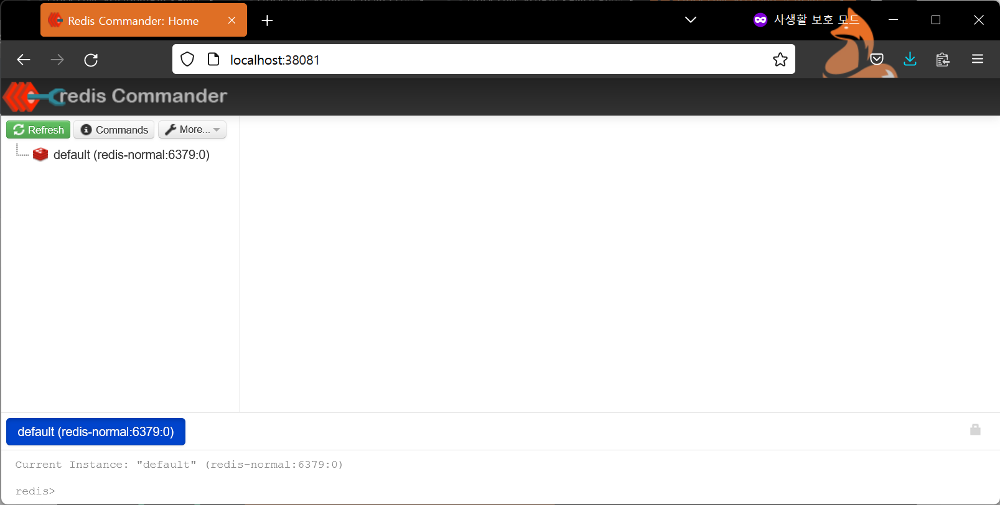

# 참고 - redis commander

운영서버나 테스트 환경에는 적용되지 않기는 하지만, 로컬에서 간단하게 초기개발 단위코드들을 디버깅하면서 개발할때는 유용한 기능이다.<br>

로컬에서 도커로 레디스를 구동시킬때 조금 귀찮음을 감수하고서라도 GUI에서 키/밸류를 확인하고자 한다면, 5분 정도만 세팅을 해두면 브라우저에서 결과들을 확인하면서 디버깅을 할 수 있다.<br>

<br>

그냥 갑자기 생각나서 정리를 시작했다. 시간 너무 많이 드는게 좀 그래서 소스 코드만 남겨둬야겠다.<br>

# 참고

참고하면 좋은 자료는 아래와 같다.

- [docker-compose redis and redis commander - Stack Overflow](https://stackoverflow.com/questions/52102475/docker-compose-redis-and-redis-commander)

<br>

# docker-compose.yml

```java
version: '3'
services:
  redis-temp:
    image: redis:7.0.2-alpine
    command: redis-server --port 6379
    #    container_name: redis-normal
    hostname: redis-normal
    labels:
      - "name=redis"
      - "mode=standalone"
    ports:
      - 36379:6379
    links:
      - redis-commander
  redis-commander:
    image: rediscommander/redis-commander:latest
    #    container_name: redis-commander
    hostname: redis-commander
    restart: always
    environment:
      - REDIS_HOSTS=redis-normal
    #      - REDIS_HOST=redis-normal:redis:16379
    ports:
      - 38081:8081
```

redis를 로컬에서 접속할 때는 16379 라는 포트를 사용하도록 해두었고, redis-commander 의 로컬 접속 포트는 18081 로 설정해두었다.<br>

이제 아래의 명령어로 구동시켜보자.<br>

```bash
docker-compose up -d
```

잘 된다.

<br>

# redis 관리 툴 - redis-commander

로컬 PC에서 localhost:38081 주소를 브라우저에 입력해서 이동하면 아래와 같은 화면이 나타나는 것을 볼 수 있다.

